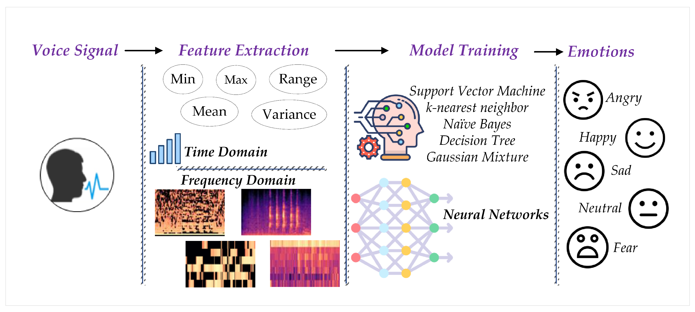

<div align="center">
    <h3> Speech Emotion Recognition </h3>
    </img>
</div>

## 📌 Table of Contents
- [Overview](#overview)
- [Features](#features)
- [Installation](#installation)
- [Usage](#usage)
- [Datasets](#datasets)
- [Model Architecture](#model-architecture)
- [Results](#results)
- [Live Demo](#live-demo)
- [Applications](#applications)
- [Limitations & Future Work](#limitations--future-work)
- [Citation](#citation)
- [License](#license)
- [Contact](#contact)

## Overview
### Speech Emotion Recognition project
This project aims to bridge the gap between speech-based emotion recognition and mental health monitoring. By analyzing vocal cues such as tone, pitch, rhythm, and energy, our system infers the speaker’s emotional state and provides insight for early detection of depression, anxiety, and stress-related conditions. This project leverages deep learning models and real-time audio processing to enable scalable and privacy-preserving emotional monitoring.


## Features
- 🎤 Analyze user speech and predict emotion in real-time
- 🧠 Use of CNN/LSTM/Transformer and optionally HMM models
- 📊 Support for 6–8 basic emotions (e.g., happy, sad, angry)
- 🌐 Streamlit Web Interface for quick demos and testing
- 📓 Google Colab for reproducible training experiments
- 🔐 Privacy-aware design, no raw audio stored

## Installation

```bash
# Clone the repository
git clone https://github.com/yourusername/speech-emotion-monitoring.git
cd speech-emotion-monitoring

# Install Python dependencies
pip install -r requirements.txt

# Train your model
python train.py

# Launch the Streamlit app
streamlit run app.py
```

## Datasets

Colons can be used to align columns.

| Dataset | Link          | Classes | Description                 |
| --------|:-------------:| -------:| ----------------------------|
| RAVDESS | URL link      | 8       | Emotion-rich speech & song  |
| CREMA-D | URL link      | 6       | Acted emotional expressions |
| CREMA-D | are URL link  | 7       | Female English speakers 60+ |

## Live Demo
▶️ Launch Streamlit App


## Applications
📱 Mobile mental health screening

🎓 E-learning emotion feedback

🧑‍⚕️ Therapy companion tools

🤖 Emotion-aware voice assistants

## Citation
```@misc{yourname2025ser,
  title={Speech Emotion Recognition for Mental Health Monitoring},
  author={Your Name},
  year={2025},
  note={Master's Thesis},
  url={https://github.com/yourusername/speech-emotion-monitoring}
}
```